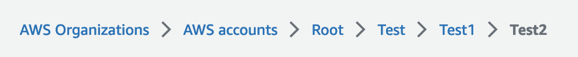
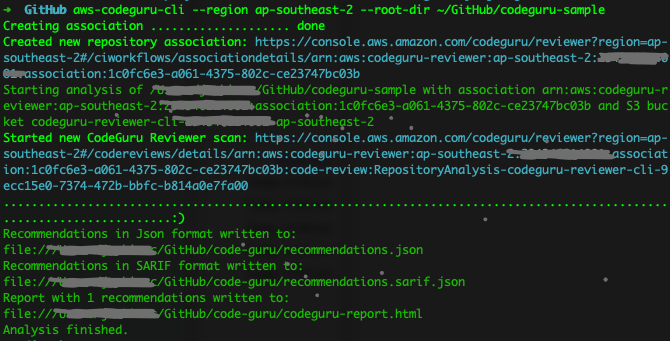
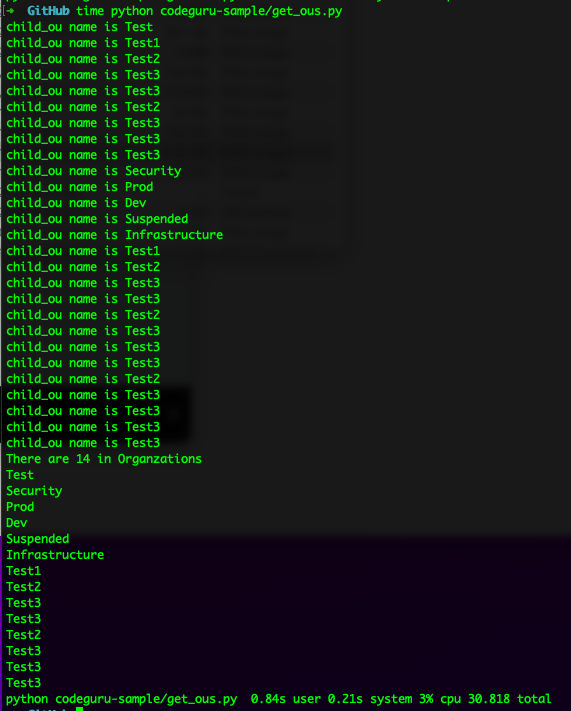
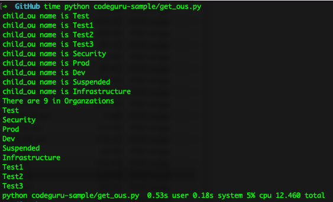

# CodeGuru Sample

There are a few OUs within the AWS Organizations in my test environment: Security, Prod, Dev, Suspended, Infrastructure and Test. The Test OU has multi layer nested child OUs.



I wrote the following Python code to query the total number of OUs in the AWS Organzation. Are you able to detect any possible issues?

Following is a Python code ([get_ous.py](./get_ous.py))

```
"""Sample code to get all OUs in AWS Organizations"""
import boto3
from botocore.exceptions import ClientError


def get_org_root_id() -> str:
    """Get AWS Organizations root id"""
    orgs_client = boto3.client("organizations")
    try:
        response_roots = orgs_client.list_roots()
        org_root_id = response_roots["Roots"][0]["Id"]
    except ClientError as error:
        print(error)
    return org_root_id


def get_child_ous(root_or_ou_id: str) -> list:
    """Get child ous for parent ou recursively"""
    child_ous = []
    orgs_client = boto3.client("organizations")
    try:
        response = orgs_client.list_organizational_units_for_parent(
            ParentId=root_or_ou_id
        )
        child_ous.extend(response["OrganizationalUnits"])
        while "NextToken" in response:
            response = orgs_client.list_organizational_units_for_parent(
                ParentId=root_or_ou_id, NextToken=response["NextToken"]
            )
            child_ous.extend(response["OrganizationalUnits"])
        for child_ou in child_ous:
            print(f"child_ou name is {child_ou['Name']}")
            child_ous.extend(get_child_ous(child_ou["Id"]))
    except ClientError as error:
        print(error)
    return child_ous


if __name__ == "__main__":
    root_id = get_org_root_id()
    all_ous = get_child_ous(root_id)
    print(f"There are {len(all_ous)} in Organzations")
    for ou in all_ous:
        print(ou["Name"])
```

If Yes, then you can skip the following unless you are intested to see what CodeGuru can do ;)

[AWS CodeGuru](https://aws.amazon.com/codeguru/) is a developer tool that provides intelligent recommendations to improve code quality and identify an application’s most expensive lines of code. It can be used via [aws-codeguru-cli](https://github.com/aws/aws-codeguru-cli) or AWS Console. I personally recommend to use CLI, as it allows you to add the Code Analysis capability into your CICD pipeline.

Here is how I ran the CLI to analyze the above codes `aws-codeguru-cli --region ap-southeast-2 --root-dir ~/GitHub/codeguru-sample`.



And CodeGuru tells me that there is a high severity issue was detected! ([Read full report](./code-guru/))

```
[ {
  "filePath" : "get_ous.py",
  "recommendationId" : "security-53df0dd0e9c18d479cb11193ba7026c599fd781795a0f30fc633c38",
  "startLine" : 31,
  "endLine" : 31,
  "description" : "It appears that you are modifying a sequence while iterating over it. The iterable object for the loop expression is calculated once and remains unchanged despite any index changes caused by the sequence modification. This might lead to unexpected bugs. If you need to modify the sequence, it is recommended that you first make a copy, such as by using slice notation.\n\n[Learn more](https://docs.python.org/3/reference/compound_stmts.html#the-for-statement)",
  "recommendationCategory" : "PythonBestPractices",
  "ruleMetadata" : {
    "ruleId" : "python/iterating-sequence-modification@v1.0",
    "ruleName" : "Error prone sequence modification",
    "shortDescription" : "Sequence modification while iterating over it might cause unexpected bugs.",
    "longDescription" : "The iterable object for the loop expression is calculated once and remains unchanged despite any index changes caused by the sequence modification. This might lead to unexpected bugs. If you need to modify the sequence, we recommend that you first make a copy, such as by using slice notation.",
    "ruleTags" : [ "availability", "data-integrity", "security", "security-context", "python" ]
  },
  "severity" : "High"
} ]
```

With above information, are you able to detect the bug now? If yes, then you can skip the following unless you want to the see how I fixed it, and also the Before vs After comparison.

**Before**



**After**



As you can see, the buggy code takes x2 more time to complete than the fixed code. Most importantly, it returns the wrong information! It counts Test2 and Test3 OU multiple times.

The fix is to change line 31 from `for child_ou in child_ous:` to `for child_ou in child_ous[:]:`. The reson is that the `child_ou` list is a moving part, it changes on the go while the code does the recursive queries. It should use slice notation to make a copy of the list first.

I definitly consider to add CodeGuru into my CICD pipelines, as it helps to reduce the bugs. What do you think?
